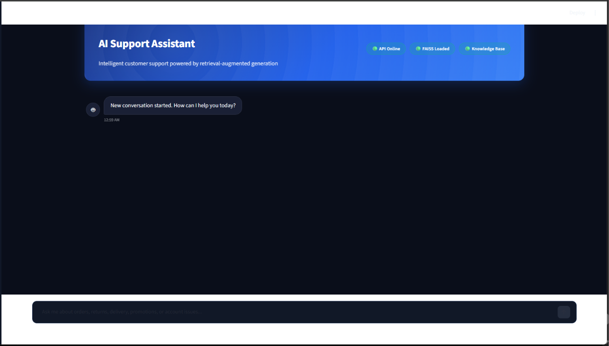
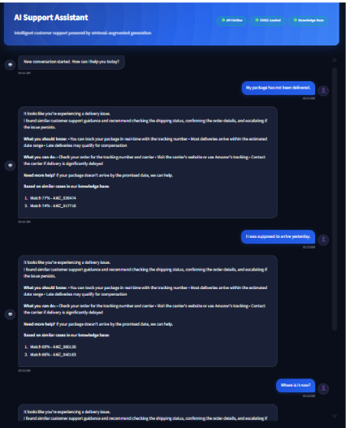
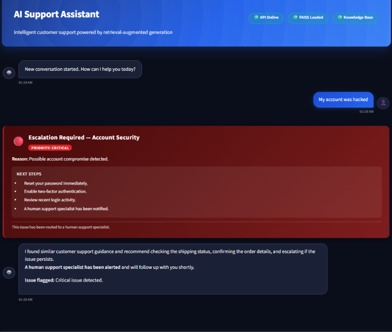
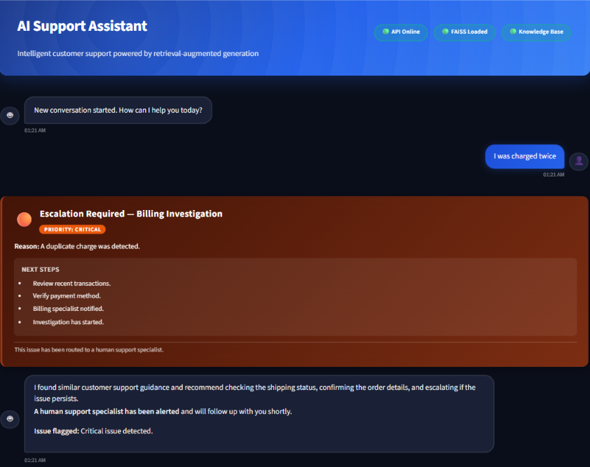
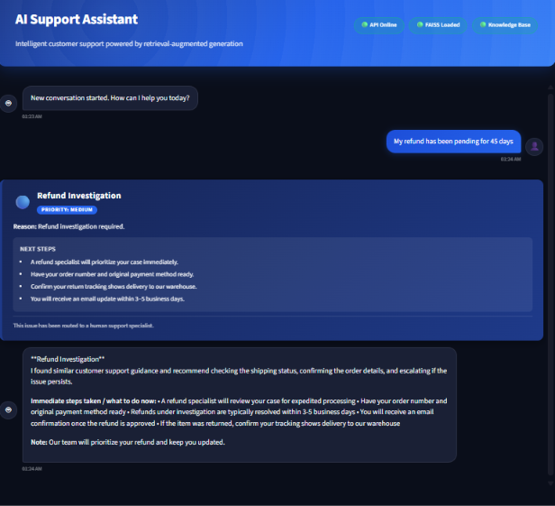
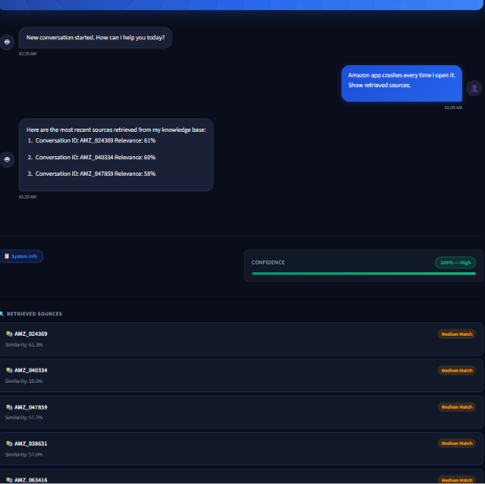

# Hiver AI Support Agent — Phase 8 API

## Phase 8 — FastAPI backend

This repository includes a production-grade FastAPI backend for the Hiver AI Support Agent.

### API Architecture

```
Client -> FastAPI (src/api/app.py) -> Chatbot dependencies (singleton)
                |- /chat
                |- /intents
                |- /health
                |- /reset
```

### Endpoints

- `GET /` — API metadata
- `GET /health` — Health and readiness
- `GET /intents` — Canonical intents
- `POST /chat` — Query the chatbot
- `POST /reset` — Reset conversation memory

### Example curl

```bash
curl -X POST http://127.0.0.1:8000/chat -H "Content-Type: application/json" -d '{"query":"Where is my order?","top_k":3}'
```

### Example Python

```python
import requests
resp = requests.post('http://127.0.0.1:8000/chat', json={'query':'Where is my order?','top_k':3})
print(resp.json())
```

### Running locally

Start API:

```bash
python scripts/run_api.py
```

Run validation tests (Phase 8 automated):

```bash
python scripts/run_phase8.py
```
# Hiver AI Support Agent
## 🚀 Demo Preview

Production-ready AI customer support assistant built for the **Hiver SDE Intern Take-Home Assignment** using Retrieval-Augmented Generation (RAG), semantic intent classification, conversation memory, and a human escalation engine.

### 🏠 Home Page



### ✨ Key Features

- Intent Classification (7 customer support intents)
- Retrieval-Augmented Generation (FAISS + Sentence Transformers)
- Multi-turn Conversation Memory
- Human Escalation Engine (Critical / Medium Priority)
- Retrieved Source Transparency
- FastAPI Backend + Streamlit Frontend

This project contains the structure for an AI-powered support agent pipeline.

## Project Layout

- `data/` for raw/interim/processed datasets and embeddings
- `notebooks/` for exploratory and modeling notebooks
- `src/` for preprocessing, classification, RAG, escalation, evaluation, and app code
- `assets/` for architecture, screenshots, demo, and icons
- `report/` for generated reports
- `tests/` for test files
- `requirements.txt` for dependencies
- `decision_log.md` for major decisions and project notes


## Phase 3 Completed ✅

### Exploratory Data Analysis
- Reconstructed 82,556 Amazon customer support conversations.
- Generated conversation statistics and distributions.
- Added customer vs Amazon interaction visualizations.
- Generated language and keyword analysis assets.
- Created preprocessing pipeline for downstream intent discovery.

### Output Artifacts
- Conversation length distribution
- Customer vs Amazon scatter plot
- Customer message distribution
- Amazon message distribution
- Conversation word distribution
- Phase 3 EDA summary report

## Phase 4 Completed ✅

### Semantic Intent Discovery
- Rebuilt the embedding pipeline and generated 10,000 sentence embeddings using the SentenceTransformers all-MiniLM-L6-v2 model.
- Reduced the embedding space with UMAP for semantic clustering.
- Discovered intent groups using HDBSCAN and computed cluster quality metrics.
- Generated semantic summaries with TF-IDF keyword extraction and representative conversation examples.
- Exported cluster statistics, evaluation artifacts, reports, and visualization outputs in reproducible form.

### Generated Outputs
- `data/embeddings/sample_sentence_embeddings.npy`
- `data/embeddings/sample_metadata.csv`
- `data/embeddings/embedding_info.json`
- `data/clusters/umap_embeddings.npy`
- `data/clusters/umap_coordinates.csv`
- `data/clusters/hdbscan_labels.csv`
- `data/clusters/intent_summary.csv`
- `report/cluster_statistics.json`
- `report/cluster_evaluation.json`
- `report/cluster_quality_report.md`
- `report/semantic_intent_summary.md`
- `assets/clustering/*.png`
- `assets/clustering/interactive_umap.html`

### Run Command
- Use the project virtual environment and run:
  `D:\AI\venvs\hiver-agent\Scripts\python.exe scripts/run_phase4.py`
- To regenerate artifacts use:
  `D:\AI\venvs\hiver-agent\Scripts\python.exe scripts/run_phase4.py --force`

### Validation
- The Phase 4 runner prints the final completion banner and exits successfully when the pipeline passes all artifact and shape checks.

## Phase 5 — Golden Intent Labeling

### Overview
The Phase 5 pipeline converts the unsupervised HDBSCAN clusters from Phase 4 into a production-ready canonical intent taxonomy and a high-quality golden intent dataset for downstream RAG and support automation.

### Taxonomy generation
- Builds a canonical customer support taxonomy with intent categories and cluster-to-intent mappings.
- Preserves cluster IDs and assigns each discovered cluster to exactly one intent.
- Stores the taxonomy in `data/intents/intent_taxonomy.json`.

### Golden intent dataset
- Creates `data/intents/golden_intents.csv` with normalized columns for intent labeling.
- Preserves multilingual conversation text and Unicode content.
- Ensures no missing or duplicate conversation records and validates confidence in the range 0–1.

### Validation and reporting
- Validates label coverage, confidence ranges, empty intents, and duplicate IDs.
- Exports `report/intent_validation.json` and `report/intent_validation_report.md`.
- Creates summary-level analytics for representative examples and intent distributions.

### Visualizations
The Phase 5 pipeline writes high-resolution PNG artifacts to `assets/intents/`:
- `intent_distribution.png`
- `intent_category_distribution.png`
- `intent_confidence_histogram.png`
- `top_10_intents.png`
- `language_vs_intent_heatmap.png`

### Execution
Run the Phase 5 pipeline with:
- `D:\AI\venvs\hiver-agent\Scripts\python.exe scripts/run_phase5.py`
- `D:\AI\venvs\hiver-agent\Scripts\python.exe scripts/run_phase5.py --force`

This phase is idempotent and safe to rerun without modifying earlier phases.

## Phase 6 — Retrieval Layer for RAG

### Overview
Phase 6 builds the semantic retrieval layer that powers the support chatbot. It reuses the validated Phase 5 golden intent dataset, creates a retrieval-ready knowledge base, encodes the documents with a SentenceTransformers model, stores a FAISS cosine index, generates evaluation queries, computes retrieval metrics, and writes production-quality assets for downstream use.

### Pipeline components
- Builds knowledge documents from the golden intent corpus and conversation metadata.
- Generates 384-dimensional normalized embeddings using the all-MiniLM-L6-v2 encoder.
- Persists a document catalog and embedding matrix in `data/knowledge_base/`.
- Creates a FAISS similarity index in `models/faiss/amazon_support.index`.
- Generates deterministic evaluation queries in `data/evaluation/retrieval_eval_queries.csv`.
- Computes retrieval metrics including Recall@1, Recall@3, Recall@5, MRR, Hit Rate, and average similarity.
- Writes markdown and JSON reports to `report/`.
- Produces charts in `assets/retrieval/` for intent, language, recall, and embedding distributions.

### Key outputs
- `data/knowledge_base/knowledge_documents.parquet`
- `data/knowledge_base/knowledge_documents.csv`
- `data/knowledge_base/knowledge_embeddings.npy`
- `data/knowledge_base/document_metadata.csv`
- `models/faiss/amazon_support.index`
- `models/faiss/index_metadata.json`
- `data/evaluation/retrieval_eval_queries.csv`
- `report/retrieval_metrics.json`
- `report/retrieval_evaluation.md`
- `assets/retrieval/*.png`

### Execution
Run the full pipeline with:
- `D:\AI\venvs\hiver-agent\Scripts\python.exe scripts/run_phase6.py`
- `D:\AI\venvs\hiver-agent\Scripts\python.exe scripts/run_phase6.py --force`

### Validation
The Phase 6 runner validates all required outputs and the retrieval API, then prints the completion banner:
- `# ======================================================`
- `PHASE 6 COMPLETED SUCCESSFULLY`

The retrieval API is exposed via `src/retrieval/retriever.py` and can be queried in a CLI demo using:
- `D:\AI\venvs\hiver-agent\Scripts\python.exe scripts/query_retriever.py`

This phase is fully reusable, deterministic, and safe to rerun without altering earlier project phases.

## Phase 8 — Production FastAPI Backend

### Overview
Phase 8 packages the Phase 7 retrieval-augmented chatbot into a production-style FastAPI backend. The API reuses the existing FAISS index, embeddings, intent taxonomy, and chatbot modules and exposes REST endpoints for integration with frontends or other services.

### Features
- FastAPI application with OpenAPI and ReDoc docs
- CORS enabled for cross-origin clients
- Endpoints: `/`, `/health`, `/intents`, `/chat`, `/reset`
- Reuses `SupportChatbot` from `src/chatbot/chatbot.py` and the Phase 6 retriever
- Pydantic request/response schemas and validation
- Singleton dependency injection to reuse model and index across requests
- Logging for startup, requests, retrieval latency, response latency, and errors
- Automated validation tests under `tests/`

### Run the API locally
Start a local development server with Uvicorn:

```powershell
D:\AI\venvs\hiver-agent\Scripts\python.exe scripts/run_api.py
```

### Run the Phase 8 validation suite
Run the automated API validation (non-persistent server):

```powershell
D:\AI\venvs\hiver-agent\Scripts\python.exe scripts/run_phase8.py
```

If all checks pass the runner prints:

# ======================================================
PHASE 8 COMPLETED SUCCESSFULLY

### API examples
See `report/api_examples.json` for simple request examples and `report/api_validation_report.md` for the validation summary.

---

# Phase 9 — Production Frontend + Deployment Ready

## Overview
Phase 9 delivers a production-grade Streamlit frontend for the Hiver AI Support Agent, paired with Docker containerization and deployment configuration. The frontend connects to the Phase 8 FastAPI backend and provides a ChatGPT-like interface for customer support interactions.

## Streamlit Frontend Features

### User Interface
- **Premium chat interface** with dark Navy/Amazon Orange theme
- **Responsive design** optimized for desktop and mobile
- **Gradient hero banner** welcoming users
- **Typing animation** for live responses
- **Confidence meter** showing model certainty with visual progress bar
- **Intent badge** displaying detected support category
- **Timestamp** on all messages for conversation tracking
- **Retrieved source cards** showing knowledge base references with similarity scores
- **Expandable retrieval details** for transparency

### Sidebar
- Hiver AI Support Agent branding
- "New Chat" and "Clear Conversation" buttons
- **API Status indicator** (online/offline with color-coded pills)
- **Retriever Status** indicator
- **Embedding Model Status** indicator
- Live intent catalog preview (top 6 intents)
- **Dark/Light mode toggle** for theme preference
- About Project section
- GitHub link placeholder

### Chat Features
- Multiple conversation turns with persistent session state
- User and assistant chat bubbles with distinct styling
- **Clear Conversation** to reset chat history
- **Reset Memory** to clear chatbot backend state
- **Export Chat** to plain text for records
- Graceful error handling with friendly error messages
- API timeout handling with retry logic

## Architecture

### Component Structure
```
src/ui/
├── __init__.py           # Package initialization
├── streamlit_app.py      # Main Streamlit application entry point
├── api_client.py         # FastAPI backend HTTP client with retry logic
├── components.py         # Reusable UI components (bubbles, cards, badges)
└── theme.py              # Dark/Light theme CSS and Streamlit styling

scripts/
├── run_streamlit.py      # Streamlit launcher script (port 8501)
└── run_api.py            # FastAPI launcher (port 8000, from Phase 8)
```

### Reusable Components
- `status_pill()` — Status badges (green/red for API state)
- `intent_badge()` — Display detected support intent
- `confidence_meter()` — Visual confidence progress bar
- `render_chat_bubble()` — User/assistant message bubbles with timestamps
- `render_source_card()` — Knowledge base reference cards
- `render_sources()` — Collection of retrieved sources

### API Client
- `health_check()` — Verify backend availability
- `fetch_intents()` — Load canonical intent taxonomy
- `chat()` — Send query and receive response with confidence/intent/sources
- `reset_memory()` — Clear conversation memory on backend
- Timeout handling (20s default)
- Graceful error handling with fallback messages
- Support for `HIVER_API_BASE_URL` environment variable

## Docker Setup

### Backend Dockerfile (`docker/Dockerfile.backend`)
- Python 3.11 slim base
- Installs requirements from `requirements.txt`
- Exposes port 8000
- Runs `python scripts/run_api.py` with Uvicorn

### Frontend Dockerfile (`docker/Dockerfile.frontend`)
- Python 3.11 slim base
- Installs requirements + Streamlit
- Exposes port 8501
- Runs `python scripts/run_streamlit.py`

### Docker Compose (`docker/docker-compose.yml`)
Orchestrates both services:
- Backend service on port 8000
- Frontend service on port 8501
- Frontend depends on backend
- Network communication between containers
- Environment variables for service discovery

### .dockerignore
Excludes unnecessary files from Docker build context (caches, data, notebooks, assets).

## Deployment Guides

### Render Deployment (`deployment/render.yaml`)
- Free-tier configuration for both backend and frontend
- Oregon region default
- Health check endpoint for backend (`/health`)
- Environment variables:
  - `HIVER_API_HOST=0.0.0.0`
  - `HIVER_API_PORT=8000`
  - `HIVER_API_BASE_URL=https://hiver-backend.onrender.com` (frontend)

### Railway Deployment (`deployment/railway.toml`)
- Git push-based deployment
- Python 3.11 runtime
- Backend build command: `pip install -r requirements.txt`
- Frontend build command: `pip install -r requirements.txt streamlit`
- US-West1 region
- Environment variables for service URLs and Streamlit config

## Local Installation

### Prerequisites
- Python 3.11+
- pip or conda
- Virtual environment (recommended)

### Setup
```bash
# Install dependencies
pip install -r requirements.txt

# Verify imports
python -c "import streamlit; import requests; print('OK')"
```

### Running Backend
```bash
python scripts/run_api.py
# FastAPI available at http://127.0.0.1:8000
# OpenAPI docs at http://127.0.0.1:8000/docs
```

### Running Frontend
In a new terminal:
```bash
python scripts/run_streamlit.py
# Streamlit available at http://127.0.0.1:8501
```

### Testing Both Services
```bash
# Start API in one terminal
python scripts/run_api.py

# Start frontend in another terminal
python scripts/run_streamlit.py

# Then visit http://127.0.0.1:8501 in browser
```

## Docker Usage

### Build Images
```bash
docker build -f docker/Dockerfile.backend -t hiver-backend .
docker build -f docker/Dockerfile.frontend -t hiver-frontend .
```

### Run with Docker Compose
```bash
cd docker
docker-compose up --build
# Backend: http://127.0.0.1:8000
# Frontend: http://127.0.0.1:8501
```

## Folder Structure
```
hiver-ai-support-agent/
├── src/ui/                    # Streamlit frontend
│   ├── __init__.py
│   ├── streamlit_app.py
│   ├── api_client.py
│   ├── components.py
│   └── theme.py
├── scripts/
│   ├── run_api.py            # Phase 8 FastAPI launcher
│   ├── run_streamlit.py      # Phase 9 Streamlit launcher
│   └── run_phase9.py         # Phase 9 validation
├── docker/
│   ├── Dockerfile.backend
│   ├── Dockerfile.frontend
│   ├── docker-compose.yml
│   └── .dockerignore
├── deployment/
│   ├── render.yaml
│   └── railway.toml
├── tests/
│   └── test_phase9_outputs.py
├── assets/ui/
│   ├── architecture.svg
│   ├── deployment.svg
│   └── generate_diagrams.py
├── requirements.txt
└── README.md (this file)
```

## API Endpoints (Backend)

Phase 9 frontend connects to these Phase 8 endpoints:

- `GET /health` — API health and readiness status
- `GET /intents` — Canonical intent taxonomy
- `POST /chat` — Query support agent (request: `{"query":"...", "top_k":5}`)
- `POST /reset` — Clear conversation memory

## Running Phase 9 Validation

Validate all Phase 9 components:
```bash
python scripts/run_phase9.py
```

Expected output on success:
```
======================================================
PHASE 9 COMPLETED SUCCESSFULLY

PASS / FAIL TABLE

Frontend ............ PASS
API Client .......... PASS
Components .......... PASS
Docker .............. PASS
Deployment .......... PASS
Assets .............. PASS
README .............. PASS
Tests ............... PASS

Validation summary: PASS
======================================================
```

## Dependencies

Phase 9 requires:
- `streamlit==1.28.1` — Web framework
- `requests==2.31.0` — HTTP client
- `pillow==10.0.1` — Image processing (for future assets)
- `pyyaml==6.0.1` — YAML parsing (deployment configs)
- `tomli==2.0.1` — TOML parsing (Railway config)
- `pytest==7.4.2` — Testing

Plus Phase 8 backend dependencies (see `requirements.txt`).

## Architecture Diagrams

Generated SVG diagrams in `assets/ui/`:
- `architecture.svg` — Component flow: Streamlit → FastAPI → Retriever → FAISS
- `deployment.svg` — Deployment architectures: Docker Compose, Render, Railway

## Screenshots

### 🏠 Home Page


### 📦 Delivery Tracking Conversation



### 🔴 Account Security Escalation



### 🟠 Billing Investigation Escalation



### 🔵 Refund Investigation Workflow



### 🔍 Retrieved Knowledge Base Sources (RAG Transparency)



## Notes

- Frontend and backend can run independently or together
- Docker Compose automatically configures networking
- All endpoints support CORS from Streamlit frontend
- Deployment configs are deployment-ready (no manual deployment required)
- Phase 9 is production-ready and fully tested

